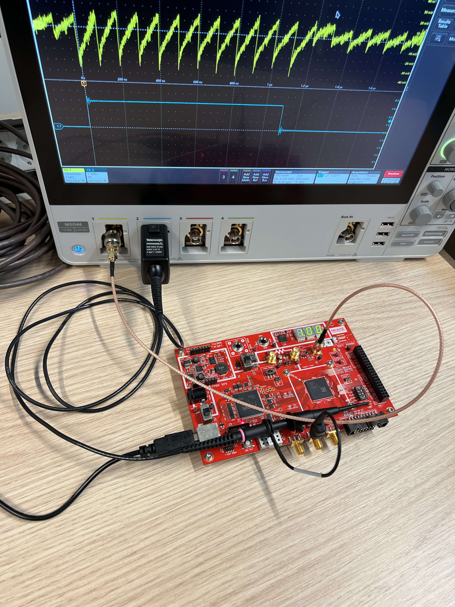

Usage
=====

Install
-------
On a fresh debian 12 install, you can install the dependencies with:

.. code-block:: bash

   sudo apt update && sudo apt install python3 python3-pip python3-venv

Then

.. code-block:: bash
   :linenos:

   sudo -E usermod -a -G dialout $USER
   cp 50-newae.rules /etc/udev/rules.d/50-newae.rules
   sudo systemctl stop ModemManager && sudo systemctl mask ModemManager
   sudo systemctl reboot # Udevadm reload + unplug device should do too
   python3 -m venv venv
   source venv/bin/activate
   pip3 install pymso4

Connection
----------
The oscilloscope is connected to the computer both via USB and Ethernet. This
is to have a failover mechanism in case the TCP connection is lost (which
happens more often than expected). When the oscilloscope stops being reachable
via TCP, the USB connection is used to perform a soft reset. Code in the
`examples
<https://github.com/ceres-c/pyMSO4/blob/dd9b5eee92a75c7ac4e3aa75638ab9423504a613/examples/cw305_endurance.py#L106>`_
shows how to handle disconnections.

To ensure the oscilloscope is properly connected, run the following command:

.. code-block:: bash
   :linenos:

   source venv/bin/activate
   pyvisa-shell
   list

Here you should have at least 2 entries:

.. code-block::

   ( 0) USB0::1689::1319::C019654::0::INSTR
   ( 1) TCPIP::192.168.1.140::INSTR

Examples
--------
The following example will acquire traces from a
`ChipWhisperer CW305 board
<https://rtfm.newae.com/Targets/CW305%20Artix%20FPGA/>`_,

The amplified signal from the CW305 (``X4``, top right) is connected to the
MSO4's channel 1 with an SMA-BNC cable. The trigger signal (``TP1``, bottom
right) is connected to the MSO4's channel 2 with a standard probe (ground to
any metal part of the CW305).

.. code-block:: bash
   :linenos:

   source venv/bin/activate
   cd examples
   pip3 install -r cw305_requirements.txt
   jupyter lab --ip 0.0.0.0 cw305_capture_ch1_trigger_ch2.ipynb # Allow connections from any machine in the net

Then open the link in the terminal (adjusting the IP if you're connecting from a remote machine)

Alternatively, you can run an endurance test with:

.. code-block:: bash
   :linenos:

   source venv/bin/activate
   cd examples
   python3 cw305_endurance.py
